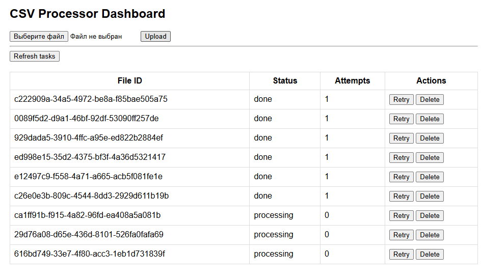

# CSV Processor

Сервис на FastAPI для обработки CSV файлов с асинхронным выполнением
задач, retry-механизмом и автоматической очисткой.

## 🚀 Возможности

-   📂 Загрузка CSV файлов
-   ⚙️ Фоновая обработка (background tasks)
-   🔁 Retry при ошибках
-   🧹 Автоматическая очистка старых файлов и задач
-   📊 Веб-интерфейс (dashboard)
-   🗂 Хранение задач в SQLite

------------------------------------------------------------------------

## 🧱 Архитектура

    app/
    ├── api/            # HTTP endpoints
    ├── services/       # бизнес-логика обработки
    ├── infrastructure/ # scheduler, db
    ├── static/         # frontend (dashboard)

------------------------------------------------------------------------

## ⚙️ Установка

``` bash
git clone https://github.com/vosart/simpleCSV.git
cd simpleCSV

python -m venv venv
venv\Scripts\activate  # Windows

pip install -r requirements.txt
```

------------------------------------------------------------------------

## ▶️ Запуск

``` bash
uvicorn app.main:app --reload
```

------------------------------------------------------------------------

## 🌐 Интерфейсы

-   API: http://127.0.0.1:8000/docs
-   Dashboard: http://127.0.0.1:8000/static/index.html

------------------------------------------------------------------------

## 📡 API

### Получить задачи

GET /tasks

### Получить все задачи (dashboard)

GET /tasks/all

### Детали задачи

GET /tasks/{file_id}

### Повторить задачу

POST /tasks/{file_id}/retry

### Удалить задачу

DELETE /tasks/{file_id}

------------------------------------------------------------------------

## 🔁 Retry механизм

-   При ошибке увеличивается attempts
-   Задача автоматически планируется повторно
-   Используется backoff стратегия

------------------------------------------------------------------------

## 🧹 Очистка

Scheduler удаляет: - старые файлы - старые записи в БД

------------------------------------------------------------------------

## 📊 Dashboard

Позволяет: - смотреть статус задач - запускать retry - удалять задачи -
отслеживать обработку в реальном времени

------------------------------------------------------------------------

## 📌 Технологии

-   FastAPI
-   APScheduler
-   SQLite
-   Vanilla JS

------------------------------------------------------------------------

## 📄 Лицензия

MIT

